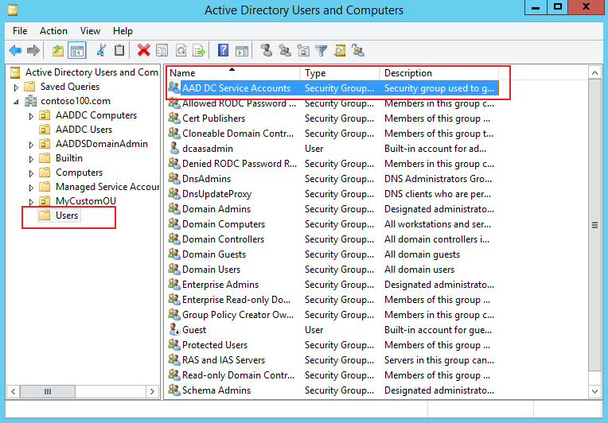
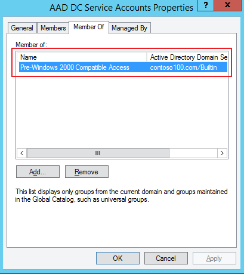
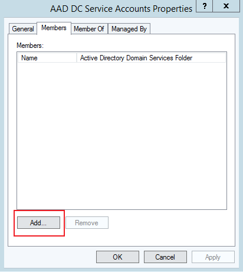
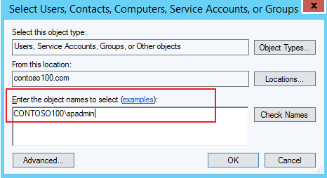

# Configure a managed domain to support profile synchronization for SharePoint Server
SharePoint Server includes a User Profile Service that is used for user profile synchronization. To set up the User Profile Service, appropriate permissions need to be granted on an Active Directory domain. For more information, see [grant Active Directory Domain Services permissions for profile synchronization in SharePoint Server 2013](https://technet.microsoft.com/library/hh296982.aspx).

This article explains how you can configure Azure AD Domain Services managed domains to deploy the SharePoint Server User Profile Sync service.

## The 'AAD DC Service Accounts' group
A security group called '**AAD DC Service Accounts**' is available within the 'Users' organizational unit on your managed domain. You can see this group in the **Active Directory Users and Computers** MMC snap-in on your managed domain.

Members of this security group are delegated the following privileges:
- The 'Replicate Directory Changes' privilege on the root DSE of the managed domain.
- The 'Replicate Directory Changes' privilege on the Configuration naming context (cn=configuration container) of the managed domain.

This security group is also a member of the built-in group **Pre-Windows 2000 Compatible Access**.

## Enable your managed domain to support SharePoint Server user profile sync
You can add the service account used for SharePoint user profile synchronization to the **AAD DC Service Accounts** group. As a result, the synchronization account gets adequate privileges to replicate changes to the directory. This configuration step enables SharePoint Server user profile sync to work correctly.

## Related Content
* [Technical Reference - Grant Active Directory Domain Services permissions for profile synchronization in SharePoint Server 2013](https://technet.microsoft.com/library/hh296982.aspx)
