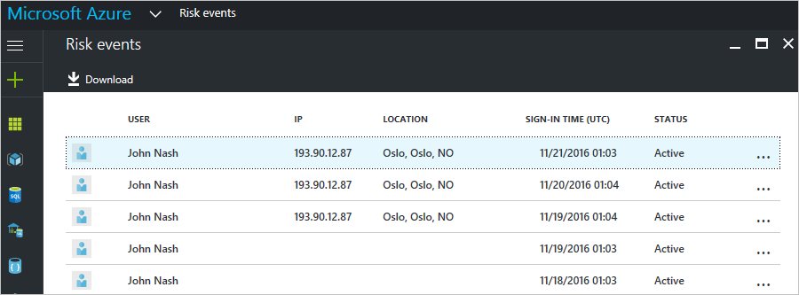
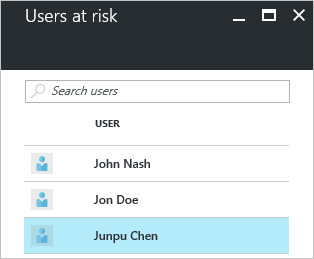
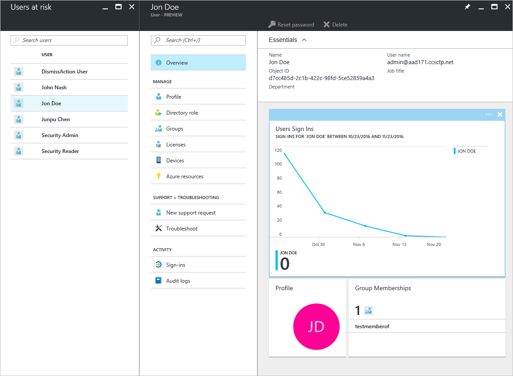

# Security reporting in the Azure Active Directory Free and Basic edition - preview

With the security reports in the Azure Active Directory [preview](active-directory-preview-explainer.md), you can gain insights into the probability of compromised user accounts in your environment. 

Azure Active Directory detects suspicious actions that are related to your user accounts. For each detected action, a record called *risk event* is created. For more details, see [Azure Active Directory risk events](active-directory-identity-protection-risk-events.md). 

The detected risk events are used to calculate:

- **Risky sign-ins** - A risky sign-in is an indicator for a sign-in attempt that might have been performed by someone who is not the legitimate owner of a user account. For more details, see [Risky sign-ins](active-directory-identityprotection.md#risky-sign-ins). 

- **Users flagged for risk** - A risky user is an indicator for a user account that might have been compromised. For more details, see [Users flagged for risk](active-directory-identityprotection.md#users-flagged-for-risk).  

## Risky sign-ins report

The Azure Active Directory free and basic editions provide you with a list of risky sign-ins that have been detected reported for your users. The risk events report provides you with:

- **User** - The name of the user that was used during the sign-in operation
- **IP** - The IP address of the device that was used to connect to Azure Active Directory
- **Location** - The location used to connect to Azure Active Directory
- **Sign-in time** - The time when the sign-in was performed
- **Status** - The status of the sign-in

This report provides you with an option to download the report data.

Based on your investigation of the risky sign-in, you can provide feedback to Azure Active Directory in form of the following actions:

- Resolve
- Mark as false positive
- Ignore
- Reactivate

For more details, see [Closing risk events manually](active-directory-identityprotection.md#closing-risk-events-manually).

## Users at risk report

The Azure Active Directory free edition provides you with a list of user accounts that may have been compromised. 

Clicking a user in the list opens the related user data blade.
For users that are at risk, review the user’s sign-in history and reset the password if necessary.

## Next steps

- For more details about Azure Active Directory reporting, see the [Azure Active Directory Reporting Guide](active-directory-reporting-guide.md).
- For more information about Azure Active Directory Identity Protection, see [Azure Active Directory Identity Protection](active-directory-identityprotection.md).

