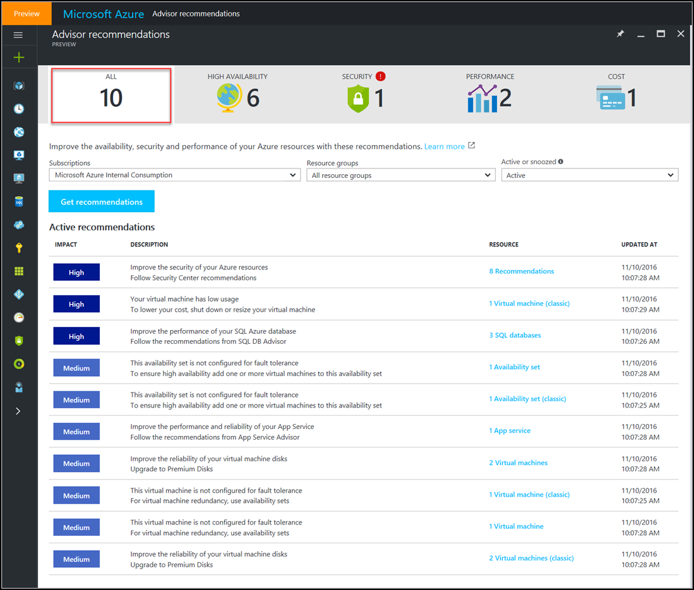

# Introduction to Azure Advisor

Learn about Azure Advisor, its key capabilities, and frequently asked questions.

## What is Azure Advisor?
Azure Advisor is a personalized cloud consultant that helps you follow best practices to optimize your Azure deployments. It analyzes your resource configuration and usage telemetry and recommends solutions that can help you improve the cost effectiveness, performance, high availability and security of your Azure resources.

With Azure Advisor, you can:
-	get proactive, actionable, and personalized best practices recommendations 
-	improve the performance, security, and high availability of your resources while looking for opportunities to reduce your overall Azure spend
-	get recommendations with inline actions

You can access Advisor through the [Azure portal](https://aka.ms/azureadvisordashboard). Sign into the [portal](https://portal.azure.com), select **Browse**, and then scroll to **Azure Advisor**. The Advisor dashboard displays personalized recommendations for a selected subscription. The recommendations are divided into four categories. 

-   **High Availability** – to ensure and improve the continuity of your business-critical applications. For more information, see [Advisor High Availability recommendations](advisor-high-availability-recommendations.md).

-   **Security** – to detect threats and vulnerabilities that could lead to potential security breaches. For more information, see [Advisor Security recommendations](advisor-security-recommendations.md).

-   **Performance** – to enhance the speed of your applications. For more information, see [Advisor Performance recommendations](advisor-performance-recommendations.md).

-   **Cost** – to optimize and reduce your overall Azure spend. For more information, see [Advisor Cost recommendations](advisor-cost-recommendations.md).

  

> [!NOTE]
> Azure Advisor generates recommendations for subscriptions where you are assigned the role of **Owner**, **Contributor**, or **Reader**.

You can click a recommendation to learn additional information about it. You can also learn about actions you can perform to take advantage of an opportunity or resolve an issue. 
Advisor offers recommendations with inline actions or documentation links. Clicking an inline action takes you through a “guided user journey” to implement it. Clicking a documentation link points you to the documentation that describes how you can manually implement the action. 

Advisor updates recommendations on an hourly basis. If you don’t intend to take an immediate action on a recommendation, you can snooze it for a time period or dismiss it. 

## Frequently asked questions

### How do I access Advisor?
You can access Advisor through the Azure portal. Sign into the portal, select **Browse**, and then scroll to **Azure Advisor**. You can also view Advisor recommendations through the virtual machine resource blade. Choose a virtual machine, and then scroll to Advisor recommendations in the menu. 

### What permissions do I need to access Advisor?

To view Advisor recommendations, you must have access to at least one subscription. Your role must be either **Owner**, **Contributor**, or **Reader** for the subscription. Subscription owners and contributors can compute/generate recommendations. However, with a **Reader** role, you can only view Advisor recommendations. 

### How often are Advisor recommendations updated?

Advisor recommendations are updated on an hourly basis.

### What resources does Advisor provide recommendations for?

Advisor provides recommendations for virtual machines, availability sets, App Services, SQL servers, SQL databases, and Redis cache.

### Can I snooze or dismiss a recommendation?

To snooze or dismiss a recommendation, click the **Snooze** button or link. You can specify a snooze time period or select **Never** to dismiss the recommendation.

## Next steps

See these resources to learn more about Advisor recommendations:

-  [Get started with Advisor](advisor-get-started.md)
-  [Advisor High Availability recommendations](advisor-high-availability-recommendations.md)
-  [Advisor Security recommendations](advisor-security-recommendations.md)
-  [Advisor Performance recommendations](advisor-performance-recommendations.md)
-  [Advisor Cost recommendations](advisor-cost-recommendations.md)
