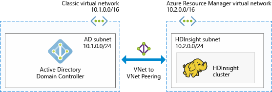
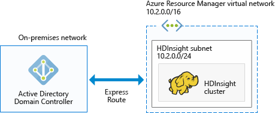

---
title: Domain-joined Azure HDInsight architecture| Microsoft Docs
description: Learn how to plan domain-joined HDInsight.
services: hdinsight
documentationcenter: ''
author: saurinsh
manager: jhubbard
editor: cgronlun
tags: azure-portal

ms.assetid: 7dc6847d-10d4-4b5c-9c83-cc513cf91965
ms.service: hdinsight
ms.devlang: na
ms.topic: hero-article
ms.tgt_pltfrm: na
ms.workload: big-data
ms.date: 02/03/2017
ms.author: saurinsh

---
# Plan Azure Domain-joined Hadoop clusters in HDInsight

The traditional Hadoop is a single user cluster. It suits for most companies that have smaller application teams building their big data workloads. As Hadoop is gaining popularity, many enterprises are moving towards a model where clusters are managed by IT teams, and multiple application teams share clusters. Thus, multi-user clusters are one of the most requested functionalities in HDInsight.

Instead of building its own multi-user authentication and authorization, HDInsight relies on the most popular identity provider – Active Directory (AD). The powerful security groups functionality in Active Directory can be used to manage multi-user authorization in HDInsight. By integrating HDInsight with Active Directory, Active Directory users can communicate with the clusters using their Active Directory credentials. HDInsight maps Active Directory user to a local Hadoop user, so that all the services running on HDInsight (Ambari, Hive server, Ranger, Spark thrift server, and so on) work seamlessly for the authenticated user.

## Integrate HDInsight with Active Directory

By integrating HDInsight with Active Directory, the HDInsight cluster nodes are domain-joined to the Active Directory domain. HDInsight creates service principals for the Hadoop services running on the cluster and place them within a specified Organizational Unit (OU) in the Active Directory. HDInsight also creates reverse DNS mappings in the Active Directory domain for the IP addresses of the nodes that are joined to the domain.

To achieve this setup, there are multiple architectures that you can follow. You need to decide which architecture works better for you.

**1. HDInsight integrated with AD running on Azure IAAS**

This is the simplest architecture for integrating HDInsight with Active Directory. The Active Directory domain controller runs on one (or multiple) virtual machines (VM) in Azure. Usually these VMs are within a virtual network. You setup another virtual network for HDInsight cluster. For HDInsight to have a line of sight to the Active Directory, you need to peer these virtual networks using [VNet to VNet peering](../virtual-network/virtual-networks-create-vnetpeering-arm-portal.md).

> [!NOTE]
> In this architecture, you can not use Azure Data Lake Store with HDInsight cluster.
 

Prerequisites for the Active Directory:

* An [Organizational Unit](../active-directory-domain-services/active-directory-ds-admin-guide-create-ou.md) must be created, within which you want to place the HDInsight cluster VMs and the service principals used by the cluster.
* [LDAPS](../active-directory-domain-services/active-directory-ds-admin-guide-configure-secure-ldap.md) must be setup for communicating with the Active Directory. The certificate used to setup LDAPS must be a real certificate (not a self-signed certificate).
* Reverse DNS zones must be created on the domain for the IP address range of the HDInsight Subnet (for example 10.2.0.0/24 in the previous picture).
* A service account, or a user account is needed, which issued to create the HDInsight cluster. This account must have the following permissions:

    - Permissions to create service principal objects and machine objects within the organizational unit.
    - Permissions to create reverse DNS proxy rules
    - Permissions to join machines to the Active Directory domain.

**2. HDInsight integrated with a cloud-only Azure AD**

For a cloud-only Azure Active Directory (Azure AD), you need to configure a domain controller so that HDInsight can be integrated with your Azure Active Directory. This is achieved by using [Azure Active Directory domain services](../active-directory-domain-services/active-directory-ds-overview.md) (Azure AD DS). The Azure AD DS creates domain controller machines on the cloud, and provides you with IP addresses for them. It creates two domain controllers for high availability.

Currently, Azure AD DS only exists in classic VNets. It is only accessible using the classic Azure portal. The HDInsight VNet exists in the Azure portal, which needs to be peered with the classic VNet using VNet to VNet peering.

> [!NOTE]
> Peering between a classic VNet and an Azure Resource Manager VNet requires both VNets are in the same region, and both VNets are under the same Azure subscription.

Prerequisites for the Active Directory:

* An [Organizational Unit](../active-directory-domain-services/active-directory-ds-admin-guide-create-ou.md) must be created, within which you want to place the HDInsight cluster VMs and the service principals used by the cluster. 
* [LDAPS](../active-directory-domain-services/active-directory-ds-admin-guide-configure-secure-ldap.md) must be setup when you configure AD DS. The certificate used to setup LDAPS must be a real certificate (not a self-signed certificate).
* Reverse DNS zones must be created on the domain for the IP address range of the HDI Subnet (for example 10.2.0.0/24 in the previous picture). 
* [Password hashes](../active-directory-domain-services/active-directory-ds-getting-started-password-sync.md) must be synced from Azure AD to AD DS.
* A service account, or a user account is needed, which is used to create the HDInsight cluster. This account must have the following permissions:

    - Permissions to create service principal objects and machine objects within the organizational unit.
    - Permissions to create reverse DNS proxy rules
    - Permissions to join machines to the Active Directory domain.

**3. HDInsight integrated with an on-premises AD via VPN**

This architecture is similar the architecture #1. The only difference is that the Active Directory is on-premises and the line of sight for HDInsight to Active Directory is via a [VPN connection from Azure to on-premises network](../expressroute/expressroute-introduction.md).

> [!NOTE]
> In this architecture, you can not use Azure Data Lake Store with HDInsight cluster.

Prerequisites for the Active Directory:

* An [Organizational Unit](../active-directory-domain-services/active-directory-ds-admin-guide-create-ou.md) must be created, within which you want to place the HDInsight cluster VMs and the service principals used by the cluster.
* [LDAPS](../active-directory-domain-services/active-directory-ds-admin-guide-configure-secure-ldap.md) must be setup for communicating with the Active Directory. The certificate used to setup LDAPS must be a real certificate (not a self-signed certificate).
* Reverse DNS zones must be created on the domain for the IP address range of the HDI Subnet (for example 10.2.0.0/24 in the previous picture).
* A service account, or a user account is needed, which is used to create the HDInsight cluster. This account must have the following permissions:

    - Permissions to create service principal objects and machine objects within the organizational unit.
    - Permissions to create reverse DNS proxy rules
    - Permissions to join machines to the Active Directory domain.

**4. HDInsight integrated with an on-premises AD synced to an Azure AD**

This architecture is similar to the architecture #2. The only difference is that the on-premises Active Directory is synced to the Azure Active Directory. You need to configure a domain controller in the cloud so that HDInsight can be integrated with your Azure Active Directory. This is achieved using [Azure Active Directory domain services](../active-directory-domain-services/active-directory-ds-overview.md) (AD DS). The AD DS creates domain controller machines on the cloud, and provides you with IP addresses for them. It creates two domain controllers for high availability.

Currently, Azure AD DS only exists in classic VNets. It is only accessible using the classic Azure portal. The HDInsight VNet exists in the Azure portal, which needs to be peered with the classic VNet using VNet to VNet peering.

> [!NOTE]
> Peering between a classic VNet and an Azure Resource Manager VNet requires both VNets are in the same region, and both VNets are under the same Azure subscription.

Prerequisites for the Active Directory:

* An [Organizational unit](../active-directory-domain-services/active-directory-ds-admin-guide-create-ou.md) must be created, within which you want to place the HDInsight cluster VMs and the service principals used by the cluster. 
* [LDAPS](../active-directory-domain-services/active-directory-ds-admin-guide-configure-secure-ldap.md) must be setup when you configure AD DS. The certificate used to setup LDAPS must be a real certificate (not a self-signed certificate).
* Reverse DNS zones must be created on the domain for the IP address range of the HDI Subnet (for example 10.2.0.0/24 in the previous picture). 
* [Password hashes](../active-directory-domain-services/active-directory-ds-getting-started-password-sync.md) must be synced from Azure AD to AD DS.
* A service account, or a user account is needed, which is used to create the HDInsight cluster. This account must have the following permissions:

    - Permissions to create service principal objects and machine objects within the organizational unit.
    - Permissions to create reverse DNS proxy rules
    - Permissions to join machines to the Active Directory domain.

**5. HDInsight integrated with a non-default Azure AD (recommended only for testing and development)**

This architecture is similar to architecture #2. For most companies, the admin access to Active Directory is restricted to only certain individuals. Thus, when you want to do a proof-of-concept, or just try out creating a domain-joined cluster, instead of waiting for admin to configure pre-requisites on the Active Directory, it may be beneficial to just create a new Azure Active Directory in the subscription. Since this is an Azure AD that you created, you have full permissions to this Azure AD to configure the AD DS.

The AD DS creates domain controller machines on the cloud, and provides you with IP addresses for them. It creates two domain controllers for high availability.

The AD DS only exists in Classic VNets today, and hence you need access to Classic portal, and  need to create a classic VNet for configuring AD DS. The HDInsight VNet exists in the Azure portal, which needs to be peered with the classic VNet using VNet to VNet peering.

> [!NOTE]
> Peering between Classic and Azure Resource Manager VNets requires both VNets are in the same region, and both VNets are under the same Azure subscription.

Prerequisites for the Active Directory:

* An [Organizational unit](../active-directory-domain-services/active-directory-ds-admin-guide-create-ou.md) must be created, within which you want to place the HDInsight cluster VMs and the service principals used by the cluster. 
* [LDAPS](../active-directory-domain-services/active-directory-ds-admin-guide-configure-secure-ldap.md) must be setup when you configure AD DS. You can create a [self-signed certificate](../active-directory-domain-services/active-directory-ds-admin-guide-configure-secure-ldap.md) to configure LDAPS. However, to use a self-signed certificate, you need to request an exception from <a href="mailto:hdipreview@microsoft.com">hdipreview@microsoft.com</a>.
* Reverse DNS zones must be created on the domain for the IP address range of the HDI Subnet (for example 10.2.0.0/24 in the previous picture). 
* [Password hashes](../active-directory-domain-services/active-directory-ds-getting-started-password-sync.md) must be synced from Azure AD to AD DS.
* A service account, or a user account is needed, which is used to create the HDInsight cluster. This account must have the following permissions:

    - Permissions to create service principal objects and machine objects within the organizational unit.
    - Permissions to create reverse DNS proxy rules
    - Permissions to join machines to the Active Directory domain.

## Next steps
* For configuring a Domain-joined HDInsight cluster, see [Configure Domain-joined HDInsight clusters](hdinsight-domain-joined-configure.md).
* For managing Domain-joined HDInsight clusters, see [Manage Domain-joined HDInsight clusters](hdinsight-domain-joined-manage.md).
* For configuring Hive policies and run Hive queries, see [Configure Hive policies for Domain-joined HDInsight clusters](hdinsight-domain-joined-run-hive.md).
* For running Hive queries using SSH on Domain-joined HDInsight clusters, see [Use SSH with Linux-based Hadoop on HDInsight from Linux, Unix, or OS X](hdinsight-hadoop-linux-use-ssh-unix.md).

