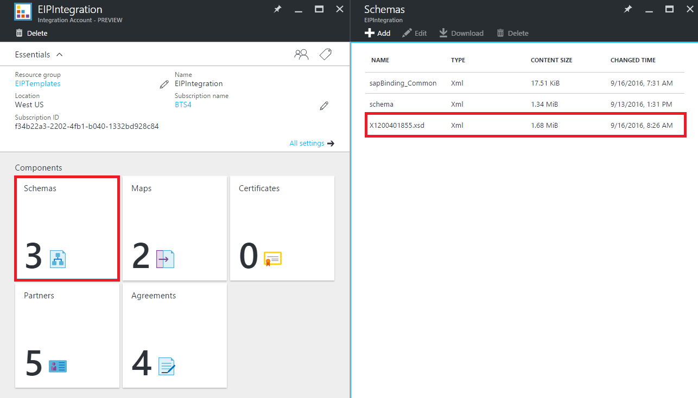
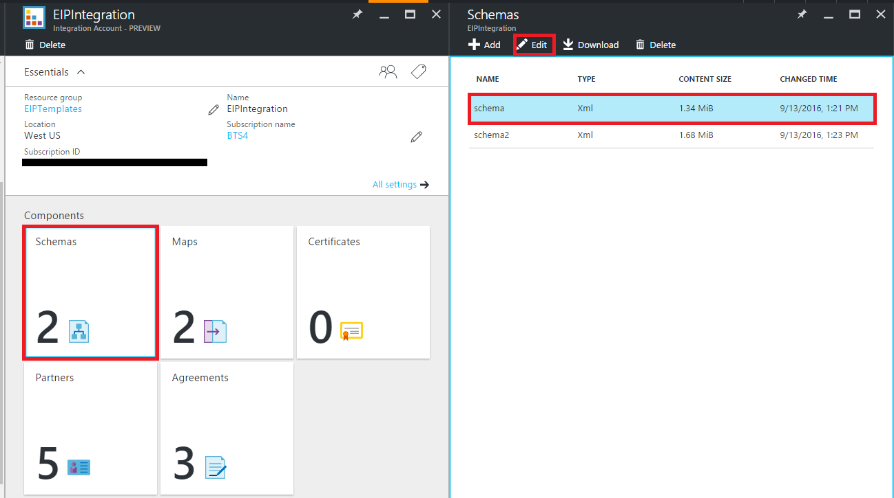
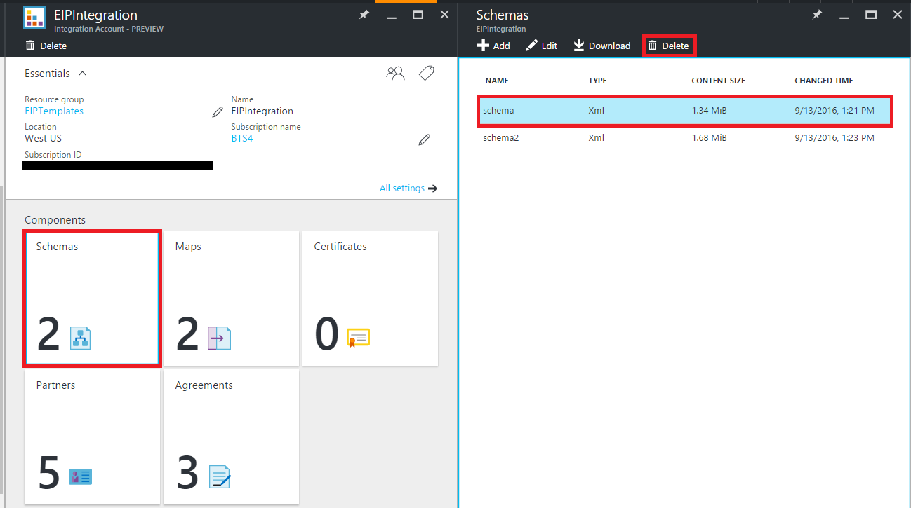
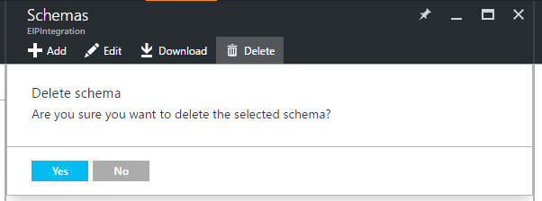

# Learn about schemas and the Enterprise Integration Pack
## Why use a schema?
Use schemas to confirm that XML documents you receive are valid, with the expected data in a predefined format. Schemas are used to validate messages that are exchanged in a B2B scenario.

## Add a schema
From the Azure portal:  

1. Select **More services**.  
       
2. In the filter search box, enter **integration**, and select **Integration Accounts** from the results list.     
     
3. Select the **integration account** to which you add the schema.    
     
4. Select the **Schemas** tile.  
     

### Add a schema file less than 2 MB
1. In the **Schemas** blade that opens (from the preceding steps), select **Add**.  
     
2. Enter a name for your schema. Then, to upload the schema file, select the folder icon next to the **Schema** text box. After the upload process is completed, select **OK**.    
     

### Add a schema file larger than 2 MB (up to a maximum of 8 MB)
The process for this depends on the blob container access level: **Public** or **No anonymous access**. To determine this access level, in **Azure Storage Explorer**, under **Blob Containers**, select the blob container you want. Select **Security**, and select the **Access Level** tab.

1. If the blob security access level is **Public**, follow these steps.  
     
   
    a. Upload the schema to storage, and copy the URI.  
      
   
    b. In **Add Schema**, select **Large file**, and provide the URI in the **Content URI** text box.  
      
2. If the blob security access level is **No anonymous access**, follow these steps.  
     
   
    a. Upload the schema to storage.  
    
   
    b. Generate a shared access signature for the schema.  
    
   
    c. In **Add Schema**, select **Large file**, and provide the shared access signature URI in the **Content URI** text box.  
      
3. In the **Schemas** blade of the EIP Integration Account, you should now see the newly added schema.  
   

## Edit schemas
1. Select the **Schemas** tile.  
2. Select the schema you want to edit from the **Schemas** blade that opens.
3. On the **Schemas** blade, select **Edit**.  
       
4. Select the schema file you want to edit by using the file picker dialog box that opens.
5. Select **Open** in the file picker.  
     
6. You receive a notification that indicates the upload was successful.  

## Delete schemas
1. Select the **Schemas** tile.  
2. Select the schema you want to delete from the **Schemas** blade that opens.  
3. On the **Schemas** blade, select **Delete**.
     
4. To confirm your choice, select **Yes**.  
     
5. Finally, notice that the list of schemas in the **Schemas** blade refreshes, and the schema you deleted is no longer listed.  
       

## Next steps
* [Learn more about the Enterprise Integration Pack](logic-apps-enterprise-integration-overview.md "Learn about the enterprise integration pack").  

