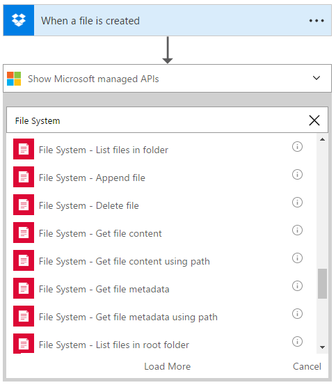
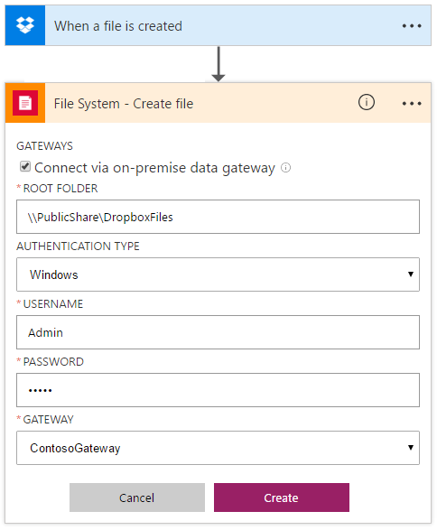
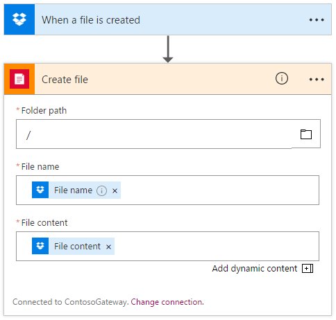
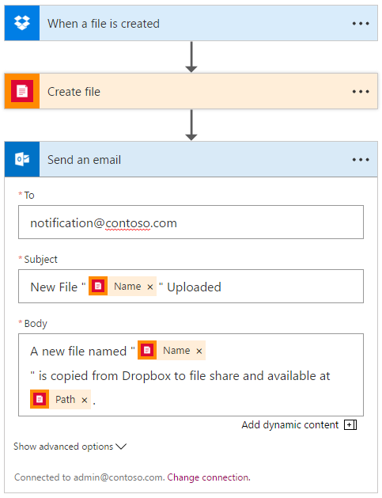

# Use the File System connector with the on-premises data gateway in a logic app

Hybrid cloud connectivity is at the heart of Logic Apps. On-premises data gateway enables you to manage data and securely access resources that are on-premises from Logic Apps. In this article, we demonstrate how to connect to an on-premises file system with a simple scenario: copy a file that’s uploaded to Dropbox to a file share, then send an email.

## Prerequisites
- Install and configure the latest [on-premises data gateway](https://www.microsoft.com/en-us/download/details.aspx?id=53127).
- Install the latest on-premises data gateway, version 1.15.6150.1 or above. [Connect to the on-premises data gateway](http://aka.ms/logicapps-gateway) lists the steps. The gateway must be installed on an on-premises machine before you can continue with the rest of the steps.

## Use File System connector

1. Let’s create a Dropbox “When a file is created" trigger, then, get a glance of all the supported file connector action is as simple as typing “File System” in search.

 

2. Choose “Create file” and create a connection for it.
 - If you don't have an existing connection, you are prompted to create one.
 - Check “Connect via on-premises data gateway” option. More properties are displayed.
 - Select the root folder. The root folder can be a local folder on the machine where the on-premises data gateway is installed, or it can be a network share that the machine has access to.
 - Enter the username and password to the gateway.
 - Select the gateway you installed from previous step.
	
 > [!NOTE]
 > Root Folder is the main parent folder, which is used for relative paths for all file-related actions.

 

3. Once you have provided all the details, click “Create”. Logic Apps configures and tests the connection to make sure it's working properly. If everything checks out, you  see options for the card you selected previously. The file system connector is now ready for use.

4. Take the file uploaded to Dropbox, and copy it to the root folder of the file share located on-premises.

 

5. Once the file is copied, let’s send an e-mail so relevant users know about it. Like other connectors, output from previous actions are available in the “dynamic content” selector.
 - Enter the recipients, title, and body of the email. Use the “dynamic content” selector to pick the output from file connector to make the email richer.

 

6. Save your Logic App, and test it by uploading a file to Dropbox. You should see the file being copied to the on-premises file share, and receive an email notification on the operation.

	> [!TIP] 
	> Check out how to [monitor your Logic Apps](../logic-apps/logic-apps-monitor-your-logic-apps.md).

7. All done, now you have a working Logic App using the file system connector. You can start exploring other functionalities it offers:

	- Create file
	- List files in folder
	- Append file
	- Delete file
	- Get file content
	- Get file content using path
	- Get file metadata
	- Get file metadata using path
	- List files in root folder
	- Update file

## Next steps
- Learn about [Enterprise Integration Pack](../logic-apps/logic-apps-enterprise-integration-overview.md). 
- Create an [on-premises connection](../logic-apps/logic-apps-gateway-connection.md) to Logic Apps.
