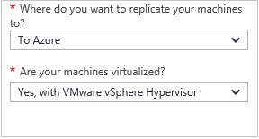

# Set up the source environment (VMware to Azure)
> [!div class="op_single_selector"]
> * [VMware Virtual Machines](./site-recovery-set-up-vmware-to-azure.md)
> * [Physical Servers](./site-recovery-set-up-physical-to-azure.md)

This article describes how to set up your on-premises environment to start replicating virtual machines running on VMware into Azure.

## Prerequisites

The article assumes that you have already created
1. A Recovery Services Vault [Azure portal](http://portal.azure.com "Azure portal").
2. A dedicated account in your VMware vCenter that can be used for [automatic discovery](./site-recovery-vmware-to-azure.md#vmware-account-permissions)
3. A virtual machine to install the Configuration Server.

### Configuration Server Minimum Requirements
The Configuration Server software should be deployed on a **highly available** VMware virtual machine. The following table lists out the minimum hardware, software, and network requirements for a configuration server.
[!INCLUDE [site-recovery-configuration-server-requirements](../../includes/site-recovery-configuration-server-requirements.md)]

> [!NOTE]
> HTTPS-based proxy servers are not supported by the Configuration Server.

## Choose your protection goals

1. In the Azure portal browse to **Recovery Services** vaults blade, and select your vault.
2. In the Resource Menu of the vault click **Getting Started** > **Site Recovery** > **Step 1: Prepare Infrastructure** > **Protection goal**.

    
3. In **Protection goal**, select **To Azure**, and select **Yes, with VMware vSphere Hypervisor**. Then click **OK**.

    

## Set up the source environment
Setting up the source environment involved two main activities

1. Installing and Registering a Configuration Server with Site Recovery Service.
2. Discovering your on-premises virtual machines by connecting Azure Site Recovery to your on-premises VMware vCenter or vSphere EXSi hosts

### Step 1: Install & Register a Configuration Server

1. Click **Step 1: Prepare Infrastructure** > **Source**. In **Prepare source**, if you don’t have a configuration server click **+Configuration server** to add one.

    
2. In the **Add Server** blade, check that **Configuration Server** appears in **Server type**.
4. Download the Site Recovery Unified Setup installation file.
5. Download the vault registration key. You need the registration key when you run Unified Setup. The key is valid for **five** days after you generate it.

	
6. On the machine you’re using as the configuration server, run **Azure Site Recovery Unified Setup** to install the configuration server, the process server, and the master target server.

#### Running the Azure Site Recovery Unified Setup

> [!TIP]
> Configuration Server registration fails if the time on your computers System Clock ahead or behind local time by more than five minutes. Synchronize your System Clock with a [Time Server](https://technet.microsoft.com/windows-server-docs/identity/ad-ds/get-started/windows-time-service/windows-time-service) before starting the installation.

[!INCLUDE [site-recovery-add-configuration-server](../../includes/site-recovery-add-configuration-server.md)]

> [!NOTE]
> The Configuration Server can be installed via command line. Read more on [installing Configuration Server using Command-line tools](http://aka.ms/installconfigsrv).

#### Add the VMware account for automatic discovery

[!INCLUDE [site-recovery-add-vcenter-account](../../includes/site-recovery-add-vcenter-account.md)]

### Step 2: Add a vCenter
To allow Azure Site Recovery to discover virtual machines running in your on-premises environment, you need to connect your VMware vCenter Server or vSphere ESXi hosts with Site Recovery

Click the +vCenter button to start connecting a VMware vCenter server or a VMware vSphere ESXi host.

[!INCLUDE [site-recovery-add-vcenter](../../includes/site-recovery-add-vcenter.md)]

## Common issues
[!INCLUDE [site-recovery-vmware-to-azure-install-register-issues](../../includes/site-recovery-vmware-to-azure-install-register-issues.md)]

## Next steps
Next step involves [setting up your target environment](./site-recovery-vmware-to-azure.md#step-3-set-up-the-target-environment) in Azure.
