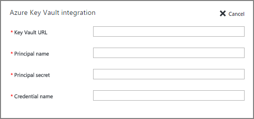

# Configure Azure Key Vault Integration for SQL Server on Azure VMs (Resource Manager)
> [!div class="op_single_selector"]
> * [Resource Manager](virtual-machines-windows-ps-sql-keyvault.md)
> * [Classic](../sqlclassic/virtual-machines-windows-classic-ps-sql-keyvault.md)
> 
> 

## Overview
There are multiple SQL Server encryption features, such as [transparent data encryption (TDE)](https://msdn.microsoft.com/library/bb934049.aspx), [column level encryption (CLE)](https://msdn.microsoft.com/library/ms173744.aspx), and [backup encryption](https://msdn.microsoft.com/library/dn449489.aspx). These forms of encryption require you to manage and store the cryptographic keys you use for encryption. The Azure Key Vault (AKV) service is designed to improve the security and management of these keys in a secure and highly available location. The [SQL Server Connector](http://www.microsoft.com/download/details.aspx?id=45344) enables SQL Server to use these keys from Azure Key Vault.

If you running SQL Server with on-premises machines, there are [steps you can follow to access Azure Key Vault from your on-premises SQL Server machine](https://msdn.microsoft.com/library/dn198405.aspx). But for SQL Server in Azure VMs, you can save time by using the *Azure Key Vault Integration* feature.

When this feature is enabled, it automatically installs the SQL Server Connector, configures the EKM provider to access Azure Key Vault, and creates the credential to allow you to access your vault. If you looked at the steps in the previously mentioned on-premises documentation, you can see that this feature automates steps 2 and 3. The only thing you would still need to do manually is to create the key vault and keys. From there, the entire setup of your SQL VM is automated. Once this feature has completed this setup, you can execute T-SQL statements to begin encrypting your databases or backups as you normally would.

[!INCLUDE [AKV Integration Prepare](../../../../includes/virtual-machines-sql-server-akv-prepare.md)]

## Enabling and configuring AKV integration
You can enable AKV integration during provisioning or configure it for existing VMs.

### New VMs
If you are provisioning a new SQL Server virtual machine with Resource Manager, the Azure portal provides a step to enable Azure Key Vault integration. The Azure Key Vault feature is available only for the Enterprise, Developer and Evaluation Editions of SQL Server.

For a detailed walkthrough of provisioning, see [Provision a SQL Server virtual machine in the Azure Portal](virtual-machines-windows-portal-sql-server-provision.md).

### Existing VMs
For existing SQL Server virtual machines, select your SQL Server virtual machine. Then select the **SQL Server configuration** section of the **Settings** blade.

In the **SQL Server configuration** blade, click the **Edit** button in the Automated Key Vault integration section.

When finished, click the **OK** button on the bottom of the **SQL Server configuration** blade to save your changes.

> [!NOTE]
> You can also configure AKV integration using a template. For more information, see [Azure quickstart template for Azure Key Vault integration](https://github.com/Azure/azure-quickstart-templates/tree/master/101-vm-sql-existing-keyvault-update).
> 
> 

[!INCLUDE [AKV Integration Next Steps](../../../../includes/virtual-machines-sql-server-akv-next-steps.md)]

