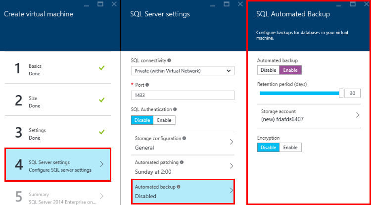
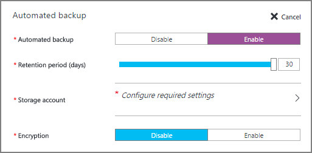

# Automated Backup for SQL Server 2014 Virtual Machines (Resource Manager)
> [!div class="op_single_selector"]
> * [Resource Manager](virtual-machines-windows-sql-automated-backup.md)
> * [Classic](../sqlclassic/virtual-machines-windows-classic-sql-automated-backup.md)
> 
> 

Automated Backup automatically configures [Managed Backup to Microsoft Azure](https://msdn.microsoft.com/library/dn449496.aspx) for all existing and new databases on an Azure VM running SQL Server 2014 Standard or Enterprise. This enables you to configure regular database backups that utilize durable Azure blob storage. Automated Backup depends on the [SQL Server IaaS Agent Extension](virtual-machines-windows-sql-server-agent-extension.md).

[!INCLUDE [learn-about-deployment-models](../../../../includes/learn-about-deployment-models-rm-include.md)]

To view the classic version of this article, see [Automated Backup for SQL Server in Azure Virtual Machines Classic](../sqlclassic/virtual-machines-windows-classic-sql-automated-backup.md).

## Prerequisites
To use Automated Backup, consider the following prerequisites:

**Operating System**:

- Windows Server 2012
- Windows Server 2012 R2

**SQL Server version/edition**:

- SQL Server 2014 Standard
- SQL Server 2014 Enterprise

> [!IMPORTANT]
> Automated Backup works with SQL Server 2014. If you are using SQL Server 2016, you can use Automated Backup v2 to back up your databases. For more information, see [Automated Backup v2 for SQL Server 2016 Azure Virtual Machines](virtual-machines-windows-sql-automated-backup-v2.md).

**Database configuration**:

- Target databases must use the full recovery model.

For more information about the impact of the full recovery model on backups, see [Backup Under the Full Recovery Model](https://technet.microsoft.com/library/ms190217.aspx).

**Azure deployment model**:

- Resource Manager

**Azure PowerShell**:

- [Install the latest Azure PowerShell commands](/powershell/azureps-cmdlets-docs) if you plan to configure Automated Backup with PowerShell.

> [!NOTE]
> Automated Backup relies on the SQL Server IaaS Agent Extension. Current SQL virtual machine gallery images add this extension by default. For more information, see [SQL Server IaaS Agent Extension](virtual-machines-windows-sql-server-agent-extension.md).

## Settings
The following table describes the options that can be configured for Automated Backup. The actual configuration steps vary depending on whether you use the Azure portal or Azure Windows PowerShell commands.

| Setting | Range (Default) | Description |
| --- | --- | --- |
| **Automated Backup** | Enable/Disable (Disabled) | Enables or disables Automated Backup for an Azure VM running SQL Server 2014 Standard or Enterprise. |
| **Retention Period** | 1-30 days (30 days) | The number of days to retain a backup. |
| **Storage Account** | Azure storage account | An Azure storage account to use for storing Automated Backup files in blob storage. A container is created at this location to store all backup files. The backup file naming convention includes the date, time, and machine name. |
| **Encryption** | Enable/Disable (Disabled) | Enables or disables encryption. When encryption is enabled, the certificates used to restore the backup are located in the specified storage account in the same `automaticbackup` container using the same naming convention. If the password changes, a new certificate is generated with that password, but the old certificate remains to restore prior backups. |
| **Password** | Password text | A password for encryption keys. This is only required if encryption is enabled. In order to restore an encrypted backup, you must have the correct password and related certificate that was used at the time the backup was taken. |

## Configuration in the Portal
You can use the Azure portal to configure Automated Backup during provisioning or for existing SQL Server 2014 VMs.

### New VMs
Use the Azure portal to configure Automated Backup when you create a new SQL Server 2014 Virtual Machine in the Resource Manager deployment model.

In the **SQL Server settings** blade, select **Automated backup**. The following Azure portal screenshot shows the **SQL Automated Backup** blade.

For context, see the complete topic on [provisioning a SQL Server virtual machine in Azure](virtual-machines-windows-portal-sql-server-provision.md).

### Existing VMs
For existing SQL Server virtual machines, select your SQL Server virtual machine. Then select the **SQL Server configuration** section of the **Settings** blade.

In the **SQL Server configuration** blade, click the **Edit** button in the Automated backup section.

When finished, click the **OK** button on the bottom of the **SQL Server configuration** blade to save your changes.

If you are enabling Automated Backup for the first time, Azure configures the SQL Server IaaS Agent in the background. During this time, the Azure portal might not show that Automated Backup is configured. Wait several minutes for the agent to be installed, configured. After that the Azure portal will reflect the new settings.

> [!NOTE]
> You can also configure Automated Backup using a template. For more information, see [Azure quickstart template for Automated Backup](https://github.com/Azure/azure-quickstart-templates/tree/master/101-vm-sql-existing-autobackup-update).
> 
> 

## Configuration with PowerShell
After provisioning your SQL VM, use PowerShell to configure Automated Backup. Before you begin, you must:

- [Download and install the latest Azure PowerShell](http://aka.ms/webpi-azps).
- Open Windows PowerShell and associate it with your account. You can do this by following the steps in the [Configure your subscription](https://docs.microsoft.com/azure/virtual-machines/windows/sql/virtual-machines-windows-ps-sql-create#configure-your-subscription) section of the provisioning topic.

In the following PowerShell example, Automated Backup is configured for an existing SQL Server 2014 VM. The **AzureRM.Compute\New-AzureVMSqlServerAutoBackupConfig** command configures the Automated Backup settings to store backups in the Azure storage account associated with the virtual machine. These backups will be retained for 10 days. The **Set-AzureRmVMSqlServerExtension** command updates the specified Azure VM with these settings.

    $vmname = "vmname"
    $resourcegroupname = "resourcegroupname"
    $autobackupconfig = AzureRM.Compute\New-AzureVMSqlServerAutoBackupConfig -Enable -RetentionPeriodInDays 10 -ResourceGroupName $resourcegroupname

    Set-AzureRmVMSqlServerExtension -AutoBackupSettings $autobackupconfig -VMName $vmname -ResourceGroupName $resourcegroupname

It could take several minutes to install and configure the SQL Server IaaS Agent.

To enable encryption, modify the previous script to pass the **EnableEncryption** parameter along with a password (secure string) for the **CertificatePassword** parameter. The following script enables the Automated Backup settings in the previous example and adds encryption.

    $vmname = "vmname"
    $resourcegroupname = "resourcegroupname"
    $password = "P@ssw0rd"
    $encryptionpassword = $password | ConvertTo-SecureString -AsPlainText -Force  
    $autobackupconfig = AzureRM.Compute\New-AzureVMSqlServerAutoBackupConfig -Enable -RetentionPeriod 10 -EnableEncryption -CertificatePassword $encryptionpassword -ResourceGroupName $resourcegroupname

    Set-AzureRmVMSqlServerExtension -AutoBackupSettings $autobackupconfig -VMName $vmname -ResourceGroupName $resourcegroupname

To disable automatic backup, run the same script without the **-Enable** parameter to the **AzureRM.Compute\New-AzureVMSqlServerAutoBackupConfig** command. The absence of the **-Enable** parameter signals the command to disable the feature. As with installation, it can take several minutes to disable Automated Backup.

> [!NOTE]
> Removing the SQL Server IaaS Agent does not remove the previously configured Automated Backup settings. You should disable Automated Backup before disabling or uninstalling the SQL Server IaaS Agent.
> 
> 

## Next steps
Automated Backup configures Managed Backup on Azure VMs. So it is important to [review the documentation for Managed Backup](https://msdn.microsoft.com/library/dn449496.aspx) to understand the behavior and implications.

You can find additional backup and restore guidance for SQL Server on Azure VMs in the following topic: [Backup and Restore for SQL Server in Azure Virtual Machines](virtual-machines-windows-sql-backup-recovery.md).

For information about other available automation tasks, see [SQL Server IaaS Agent Extension](virtual-machines-windows-sql-server-agent-extension.md).

For more information about running SQL Server on Azure VMs, see [SQL Server on Azure Virtual Machines overview](virtual-machines-windows-sql-server-iaas-overview.md).

